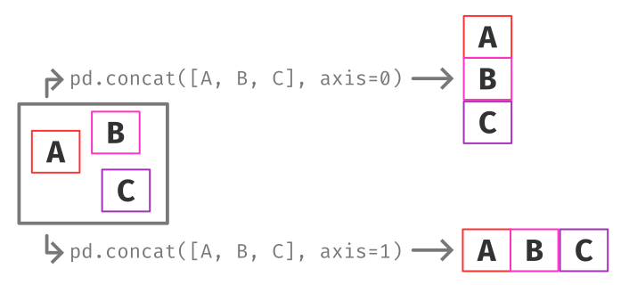

<h1 align="center"> PYTHON FINANÇAS </h1>

  

#### COMEÇANDO
<h5>03/10/2025</h5>

- Python é uma linguagem de alto nível, o que facilita o aprendizado, logo está mais próxima da lingaguem humana, onde abstraem conceitos voltados para a máquina e sintetizam comandos. Sem contar que Python é uma **LINGUAGEM INTERPRETADA**, onde passam por um programa linha por linha e executam cada comando.

<h5>04/10/2025</h5>

- Neste dia fui Explorar um pouco da BIBLIOTECA **PANDAS**, responsavel pela manipulação de dados, para usar ela, primeiramente temoss que fazer um **import pandas**

- Em seguida, precisamos entender o que é um DataFrame???

**DataFrase ->** Estrutura de dados bidimensional, como um ou uma tabela com linhas e colunas.

<h5>05/10/2025</h5>

- Hoje vou criar uma planilha .csv e depois irei reescrever por cima dela, na primeira vez aprenas criei outro arquivo em cima daquele, agora irei ler e depois escrever. O **CONCAT** serve para unir várias tabelas de dados (ou DataFrames, como são chamados no pandas ) e você precisa juntá-los em uma única tabela. É aqui que o método concat entra em jogo. O concat permite que você “cole” (concatene) DataFrames ao longo de um eixo específico, seja vertical ou horizontalment

<h5>06/10/2025</h5>

- Hoje, irei aprender um pouco de dicionario, imagine ele como um rótulo, ond 